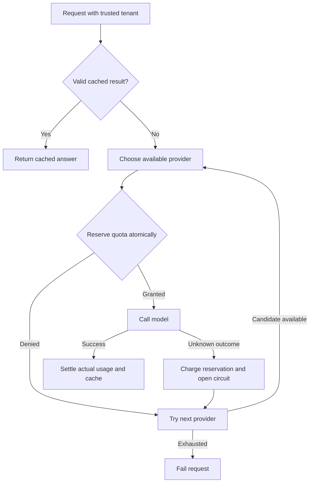

# LLM Gateway Lab

Explore the infrastructure around model calls: route by task, isolate cached
responses by tenant, reserve quota before spending it, and fall back when a
provider fails.

## Run it

```bash
python app.py demo
python app.py request --model YOUR_FAST_MODEL --fallback-model YOUR_QUALITY_MODEL \
  --tenant local-demo --task reason --prompt "Explain how to investigate editor latency."
```

The offline demo injects a failure in the fast provider, falls back to the quality
provider, serves a repeat request from cache, and proves that another tenant
does not reuse that cache entry.

## Implemented

- Explicit classify/reason routing and fallback order.
- SQLite transactions for quota reservations and settlement.
- Tenant/task/prompt/model/policy-aware cache keys with expiration.
- Conservative charging of a full reservation when provider outcome is unknown.
- Provider circuit cooldown and metadata-only traces.
- Persistent pending reservations across process restarts.
- Contract validation of model output and token usage.

## Request flow



## Boundaries

Credits are illustrative integer quota units, not money or provider prices. Input
admission uses a byte-based estimate plus overhead, not a guaranteed tokenizer
bound. Provider usage that exceeds the admitted bound is rejected and charged
conservatively. This is not a financial billing system.

Circuits are process-local; quotas and cache are persistent. Identical concurrent
cache misses may invoke the provider more than once. There is no automatic stale
reservation release because an interrupted call may still have incurred usage.
A production service needs reconciliation, authenticated tenant identity, encrypted
storage, process-shared circuits, request deduplication and calibrated token budgets.
Local model fallback has separate value only when distinct configured models are
available. There is no cross-provider quality benchmark or streaming API.

## Verification and scope

```bash
python -m unittest discover -s tests -v
```

Python 3.11+ is required. Runtime and tests use only the standard library.
GitHub Actions is configured for Python 3.11, 3.12 and 3.13; only Python 3.12
was executed during preparation. See [validation](docs/validation.md) and
[recorded demo output](docs/demo-output.json).

The default demo is deterministic and uses synthetic data. The optional Ollama
adapter follows the [generation API](https://docs.ollama.com/api/generate) and
[embedding API](https://docs.ollama.com/api/embed). Adapter contract tests use mock
responses. No live model, cloud service or paid provider was tested. Replace
model placeholders with models already installed in your local Ollama server.

This is a focused reference implementation prepared with AI assistance. It does
not claim production deployment, measured business impact, or enterprise readiness.
Read the [architecture decisions](docs/architecture.md) and
[interview walkthrough](docs/interview.md) before presenting it.
